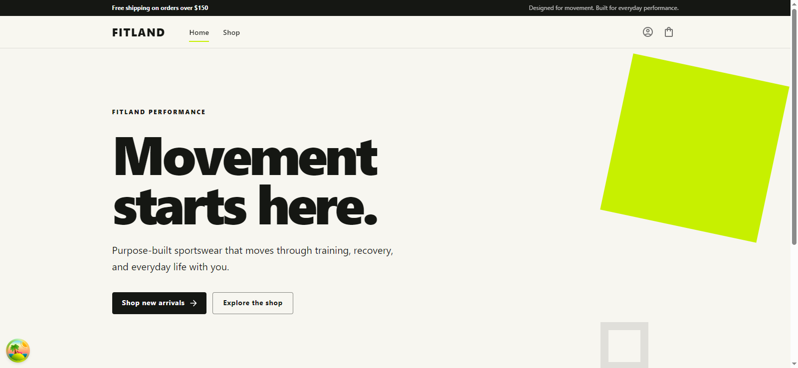
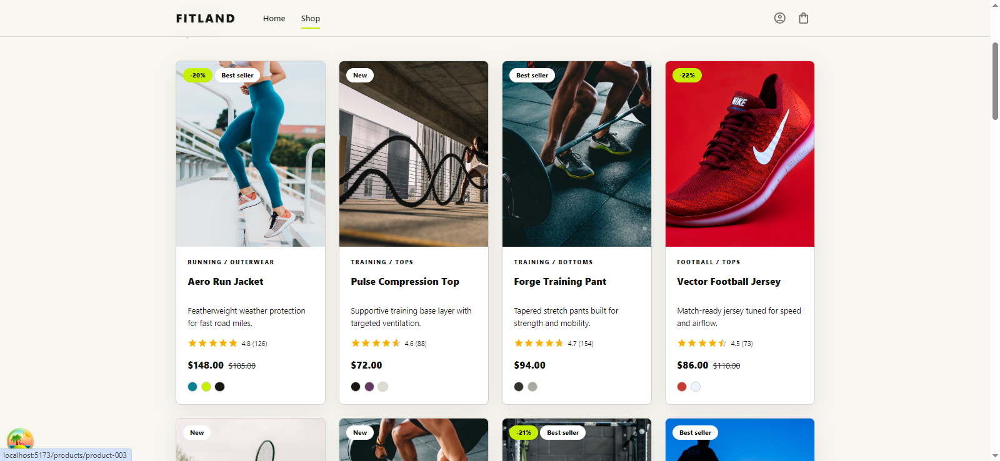
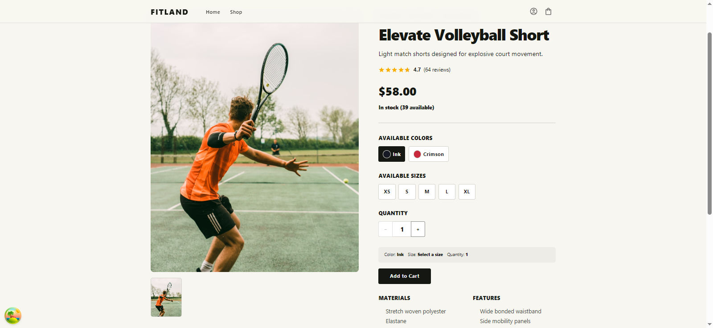
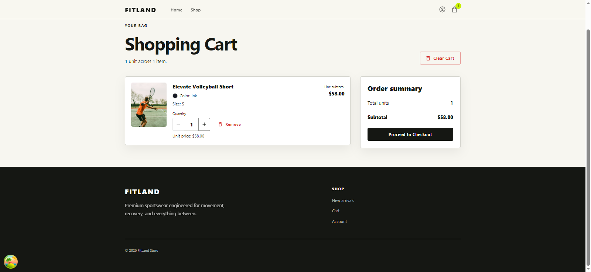
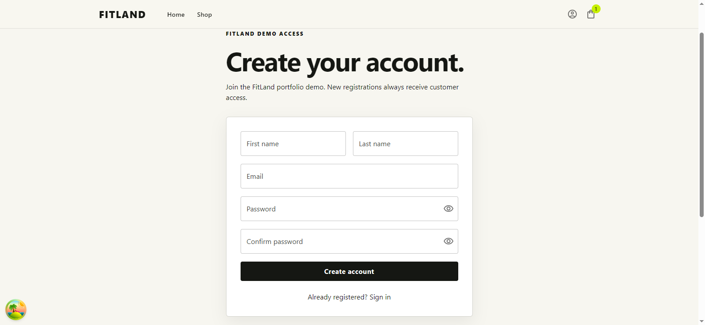

# FitLand Ecommerce

FitLand is a modern and responsive sports e-commerce web application built with React and TypeScript, featuring a mock REST API for development and testing.

---

## Tech Stack

### Frontend

- React
- TypeScript
- Vite
- React Router
- Redux Toolkit
- TanStack Query
- React Hook Form
- Zod
- Axios

### UI & Styling

- Material UI
- Emotion
- Tailwind CSS

### Data Visualization

- Recharts

### Development Tools

- ESLint
- Git
- GitHub

### Mock API

- JSON Server

---

## Features

- Responsive e-commerce interface
- Product browsing
- Product detail pages
- Product collections
- Shopping cart
- Wishlist
- User account pages
- Form validation
- API data fetching and caching
- State management

---

## Screenshots

### Home



### Shop



### Product Details



### Shopping Cart



### Register



---

## Project Structure

```text
fitland-ecommerce/
├── vite-project/          # React frontend application
└── fitland-mock-api/      # Mock REST API
```

---

## Installation

Clone the repository:

```bash
git clone https://github.com/amir464/fitland-ecommerce.git
cd fitland-ecommerce
```

### Run Mock API

```bash
cd fitland-mock-api
npm install
npm run dev
```

The Mock API runs on:

```text
http://localhost:4000
```

### Run Frontend

Open another terminal:

```bash
cd vite-project
npm install
npm run dev
```

Then open the local URL shown by Vite in your browser.

---

## Available Scripts

### Frontend

```bash
npm run dev
npm run build
npm run lint
npm run preview
```

### Mock API

```bash
npm run dev
npm run validate
```

---

## Author

**Amir Mohammad Aalipour**

GitHub: [amir464](https://github.com/amir464)

---

# نسخه فارسی

# فروشگاه اینترنتی FitLand

FitLand یک فروشگاه اینترنتی مدرن و واکنش‌گرا در حوزه محصولات ورزشی است که با React و TypeScript توسعه داده شده و برای توسعه و تست از Mock REST API استفاده می‌کند.

---

## تکنولوژی‌های استفاده‌شده

### فرانت‌اند

- React
- TypeScript
- Vite
- React Router
- Redux Toolkit
- TanStack Query
- React Hook Form
- Zod
- Axios

### رابط کاربری و استایل

- Material UI
- Emotion
- Tailwind CSS

### نمایش داده‌ها

- Recharts

### ابزارهای توسعه

- ESLint
- Git
- GitHub

### Mock API

- JSON Server

---

## امکانات پروژه

- رابط کاربری واکنش‌گرا
- مشاهده و مرور محصولات
- صفحه جزئیات محصول
- دسته‌بندی و مجموعه محصولات
- سبد خرید
- لیست علاقه‌مندی‌ها
- صفحات حساب کاربری
- اعتبارسنجی فرم‌ها
- دریافت و Cache کردن اطلاعات API
- مدیریت State برنامه

---

## تصاویر پروژه

تصاویر رابط کاربری پروژه در بخش Screenshots نسخه انگلیسی قابل مشاهده هستند.

---

## ساختار پروژه

```text
fitland-ecommerce/
├── vite-project/          # اپلیکیشن فرانت‌اند
└── fitland-mock-api/      # Mock REST API
```

---

## نصب و اجرا

ابتدا Repository را Clone کنید:

```bash
git clone https://github.com/amir464/fitland-ecommerce.git
cd fitland-ecommerce
```

### اجرای Mock API

```bash
cd fitland-mock-api
npm install
npm run dev
```

Mock API روی آدرس زیر اجرا می‌شود:

```text
http://localhost:4000
```

### اجرای فرانت‌اند

در یک Terminal جدید:

```bash
cd vite-project
npm install
npm run dev
```

سپس آدرسی که Vite در Terminal نمایش می‌دهد را در مرورگر باز کنید.

---

## دستورات پروژه

### فرانت‌اند

```bash
npm run dev
npm run build
npm run lint
npm run preview
```

### Mock API

```bash
npm run dev
npm run validate
```

---

## توسعه‌دهنده

**Amir Mohammad Aalipour**

GitHub: [amir464](https://github.com/amir464)
